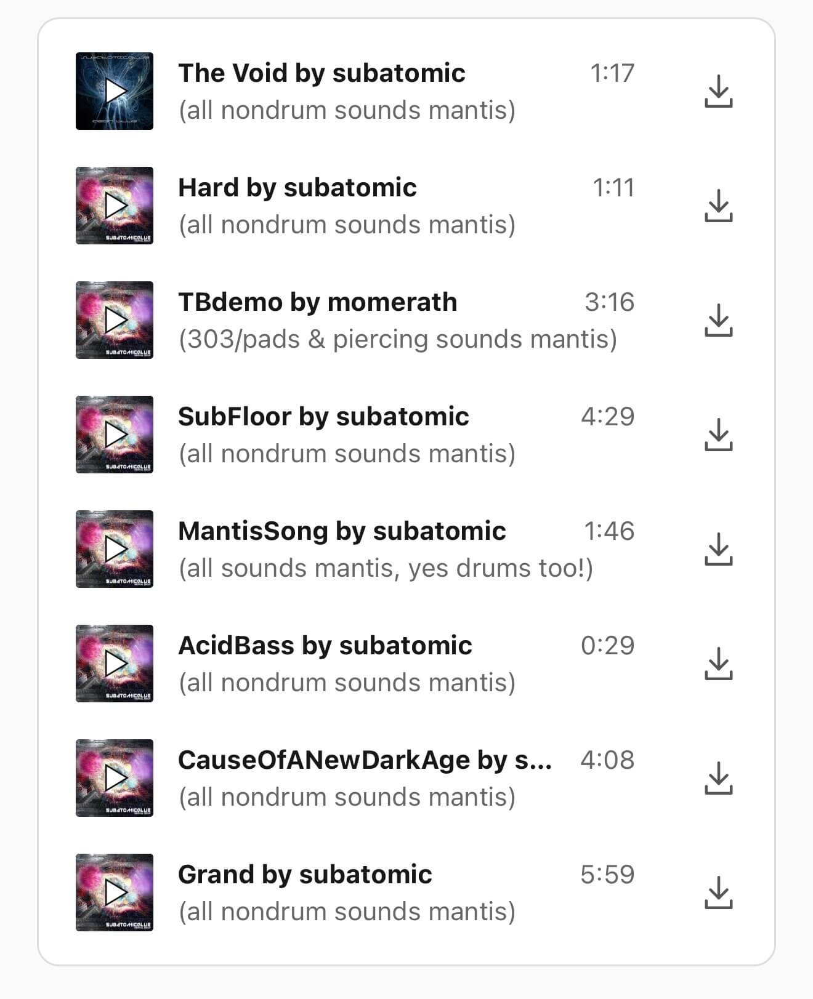
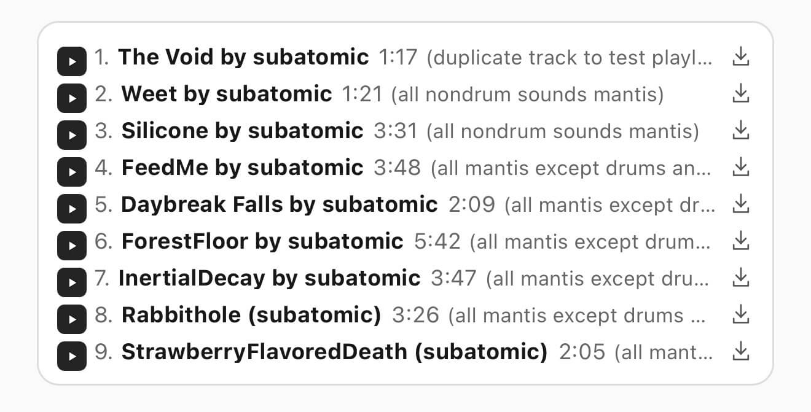
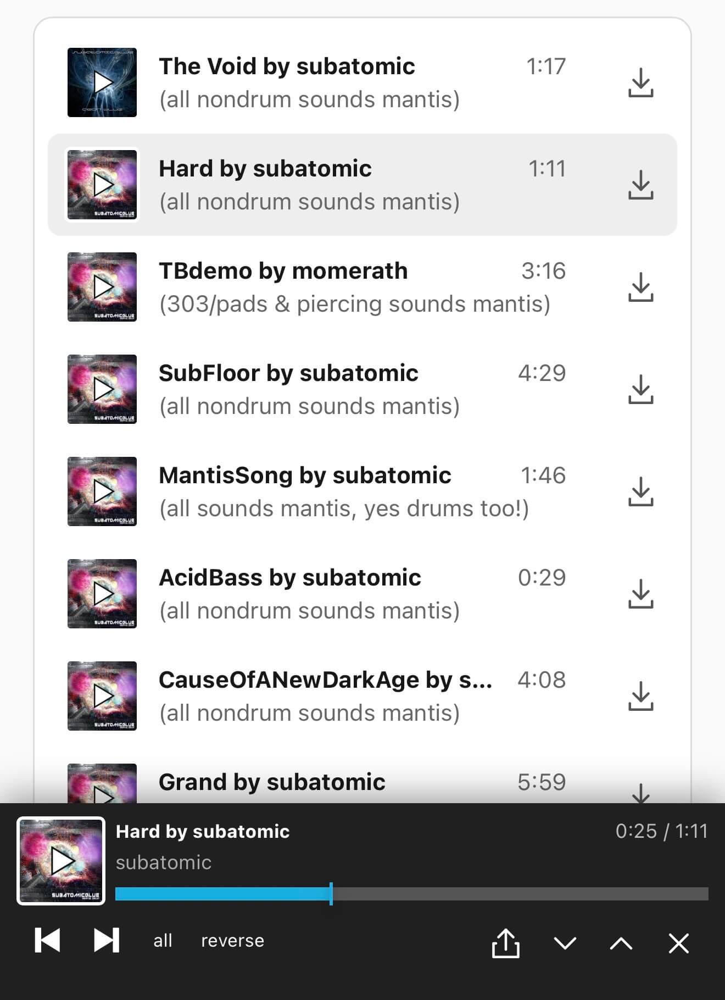
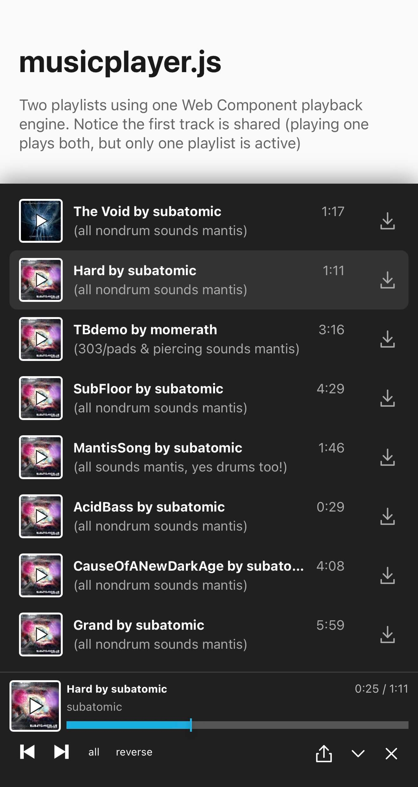
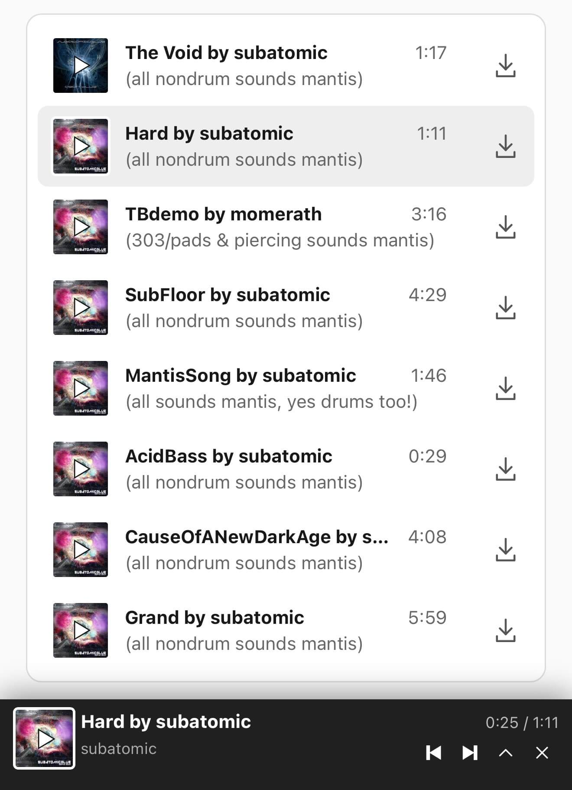
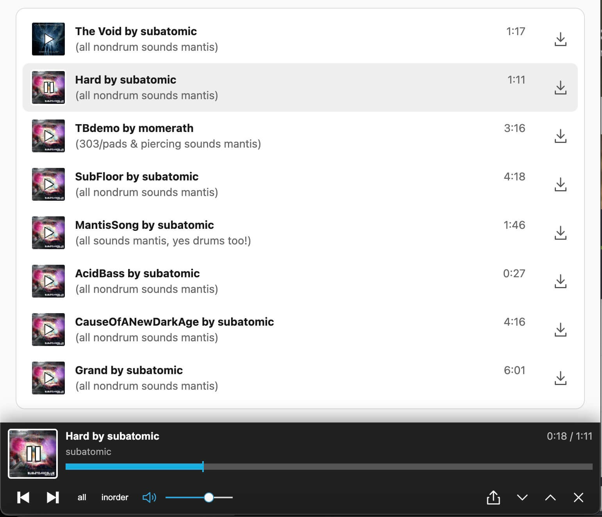

# musicplayer.js

HTML Web Component music track player

[ audioplayer demo ](http://htmlpreview.github.io/?https://raw.githubusercontent.com/subatomicglue/musicplayer.js/master/index.html)

## Preview

iOS Playlist


iOS Playlist (compact mode)


iOS player bar

iOS player bar (maximized)

iOS player bar (minimized)


Desktop (chrome browser)


## Get the code
```
git clone git@github.com:subatomicglue/musicplayer.js.git
```

## Architecture

[ARCHITECTURE.md](ARCHITECTURE.md)
